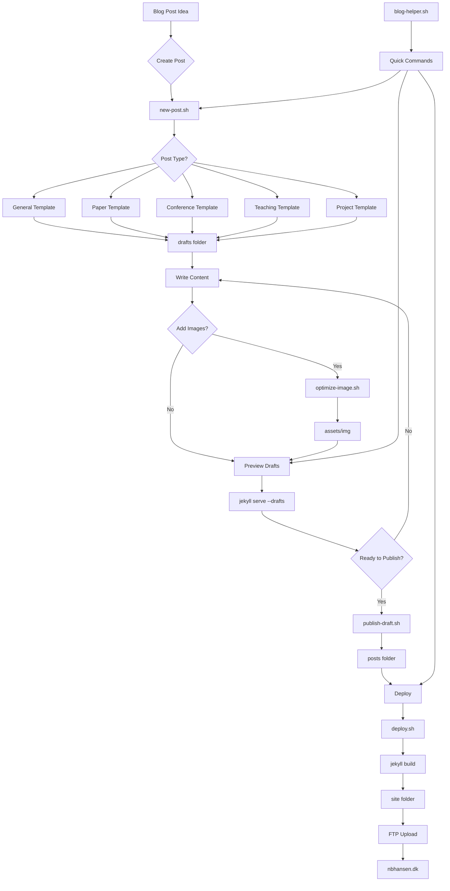

# Blog Workflow Overview

This diagram shows how the enhanced Jekyll blogging setup works from idea to published post:

## Workflow Sections

### Content Creation (Blue)
From initial idea through template selection to draft creation. The `new-post.sh` script handles all the technical details.

### Draft Workflow (Purple) 
Writing, editing, and previewing content. Includes image optimization and draft preview capabilities.

### Production Pipeline (Green)
Publishing drafts and deploying to the live website via automated FTP upload.

### Supporting Tools (Orange)
Helper scripts, content planning, and configuration files that support the entire workflow.

## Key Benefits

- **One command** from idea to draft: `./new-post.sh "Title"`
- **Visual preview** with drafts: `bundle exec jekyll serve --drafts`
- **One command** deployment: `./deploy.sh`
- **No manual file management** - scripts handle naming, dates, front matter
- **Template-driven** content creation for consistency