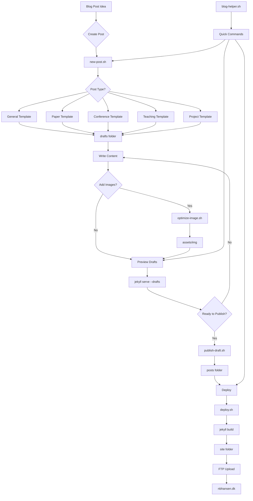

Aided by anthropics Claude, I finally managed to cut through the clutter of [Jekyll](https://jekyllrb.com/) and actually setup a workflow for running this site like I want. Very simply, the actual code can be seen on my [Github](https://github.com/nbhansen/nbhansen.github.io). In a nutshell its just a Jekyll server running locally that with the aid of a bunch of smaller linux scripts allows me to use VSCode (or any other markdown editor basically) to remove all friction from writing posts - **technical friction that is** - I sadly still have to write the actual posts but lets see now my blood is up. 

## The magic (?!?)
Its not REALLY magic but okay basically there are five bash scripts for a range of blog-related activities, like creating new posts from a markdown template, formatting images the right way, and accessing and uploading to the ftp-server at the venerable danish hosting company [www.webhosting.dk](https://www.webhosting.dk). 

Here's how the whole workflow works:

### Key Benefits

- **One command** from idea to draft: `./new-post.sh "Title"`
- **Visual preview** with drafts: `bundle exec jekyll serve --drafts`
- **One command** deployment: `./deploy.sh`
- **No manual file management** - scripts handle naming, dates, front matter
- **Template-driven** content creation for consistency

## so uhm... why not wordpress or something else?
Well, I am a giant nerd, is the first reason. Second, I love the idea of my site here consisting ONLY OF STATIC HTML/CSS/JAVASCRIPT i mean... its so fast right. Thats why. 

---

Think I do cool stuff? Why not [collaborate](../collaborate) with me?
